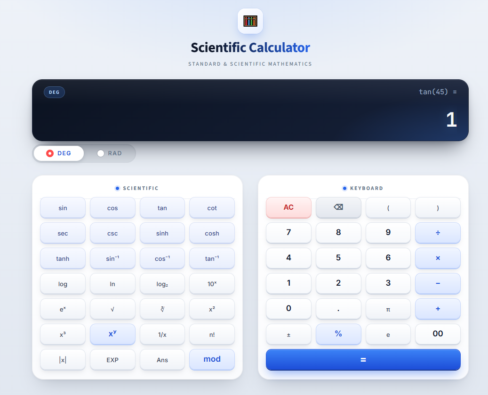

<div align="center">

# 🧮 Scientific Calculator

**A modern, polished scientific calculator interface built with Streamlit and custom CSS.**

[](https://scientificcalculator.streamlit.app/)


[**🚀 Live Demo**](https://scientificcalculator.streamlit.app/) · [Features](#-features) · [Getting Started](#-getting-started) · [Customization](#-customization) · [Roadmap](#-roadmap)

<br>



</div>

---

## 📖 About

This project is a **UI-first scientific calculator** designed to look and feel like a real calculator application, not a default Streamlit page. Every part of the interface (display, keys, cards, mode switch) is custom-styled with CSS injected into Streamlit.

> **Status:** UI only. Buttons are not connected to calculation logic yet, and the display shows a fixed dummy example (`tan(45) = 1`). See the [Roadmap](#-roadmap) for what comes next.

---

## ✨ Features

| | Feature |
|---|---|
| 🖥️ | Dark glass-style display with an expression line, a large result line and a mode indicator |
| 🔀 | Compact **DEG / RAD** pill switch |
| 🔢 | Two balanced cards: **Scientific** (28 keys) and **Keyboard** (24 keys + `=`) |
| ⌨️ | Keycap-style buttons with hover and press effects |
| 🎨 | Colour-coded key groups for fast scanning (see below) |
| 🧼 | Streamlit header, menu and footer hidden for a clean, app-like look |
| 📱 | Responsive: cards stack on small screens, keys stay 4 per row |

### Key groups

| Group | Keys | Style |
|---|---|---|
| Trigonometry | `sin` `cos` `tan` `cot` `sec` `csc` `sinh` `cosh` `tanh` `sin⁻¹` `cos⁻¹` `tan⁻¹` | Soft blue tint |
| Functions | `log` `ln` `log₂` `10ˣ` `eˣ` `√` `∛` `x²` `x³` `1/x` `n!` `\|x\|` `EXP` `Ans` `( )` `π` `e` `±` | Neutral |
| Digits | `0`–`9` `.` `00` | White |
| Operators | `÷` `×` `−` `+` `%` `mod` `xʸ` | Blue |
| Clear / Delete | `AC` `⌫` | Red / grey |
| Equals | `=` | Primary blue |

---

## 🛠️ Tech Stack

- **Python 3.9+**
- **[Streamlit](https://streamlit.io/)** `>= 1.39`
- **Custom CSS** injected with `st.markdown(..., unsafe_allow_html=True)`
- **Google Fonts**: Inter and JetBrains Mono (falls back to system fonts when offline)

---

## 🚀 Getting Started

### 1. Clone the repository

```bash
git clone https://github.com/muhammadjunaidai/scientific-calculator.git
cd scientific-calculator
```

### 2. (Optional) Create a virtual environment

```bash
python -m venv venv
source venv/bin/activate      # macOS / Linux
venv\Scripts\activate         # Windows
```

### 3. Install dependencies

```bash
pip install -U streamlit
```

> Streamlit **1.39 or newer** is required. The styling relies on the `key=` argument for containers and buttons.

### 4. Run the app

```bash
streamlit run app.py
```

Try the hosted version: **[scientificcalculator.streamlit.app](https://scientificcalculator.streamlit.app/)**

---

## 📁 Project Structure

```text
scientific-calculator/
├── app.py            # Streamlit app: layout + CSS
├── screenshot.png    # Preview image used in this README
└── README.md
```

### Inside `app.py`

| Section | Purpose |
|---|---|
| Button layout | `SCIENTIFIC` and `KEYBOARD` lists, plus `category()` which decides each key's style |
| Dummy display values | `DUMMY_EXPRESSION` and `DUMMY_RESULT` |
| Styles | All CSS in one `CSS` string |
| UI components | `render_header`, `render_display`, `render_mode_switch`, `render_card` |
| Page | Assembles the components |

---

## 🧠 Design Notes

- **Per-key styling without JavaScript.** Each button gets a key like `btn_tr__s3` (`btn_<type>__<id>`). Streamlit adds this as a CSS class (`st-key-...`), so one attribute selector (`[class*="st-key-btn_tr__"]`) styles an entire group.
- **CSS variables per group.** Each group only defines a few colour variables (`--k-top`, `--k-bot`, `--k-edge`, ...) and one shared rule draws the keycap, which avoids duplicated CSS.
- **Fixed display height.** The display never changes size, and long results shrink their font automatically instead of breaking the layout.
- **Stable key rows on mobile.** Streamlit normally stacks columns on small screens; the CSS keeps the 4-column key grid intact.

---

## 🎨 Customization

**Change the display text**

```python
DUMMY_EXPRESSION = "tan(45) ="
DUMMY_RESULT = "1"
```

**Change the accent colour**

Edit `--accent` and `--accent-dark` at the top of the CSS, and the `=` key colours (`--k-top`, `--k-bot`, `--k-edge`) in the `st-key-btn_eq__` rule.

**Add or remove a key**

Edit the `SCIENTIFIC` or `KEYBOARD` list. Each key takes its style from `category()`, so existing groups need no extra CSS.

---

## 🌐 Deployment (Streamlit Community Cloud)

1. Push the project to GitHub.
2. Go to [share.streamlit.io](https://share.streamlit.io) and create a new app.
3. Select the repository, branch `main` and main file `app.py`.
4. Add a `requirements.txt` containing `streamlit>=1.39`.

---

## ⚠️ Notes

- Uses the CSS `:has()` selector (for the DEG / RAD switch), so a modern browser is needed (current Chrome, Edge, Safari or Firefox).
- Designed for the **light** theme; the app sets its own colours.
- Because the Streamlit header is hidden, the default top-right menu is not shown.

---

## 🗺️ Roadmap

- [ ] Connect keys to `st.session_state` so the display updates on click
- [ ] Safe expression evaluator (no `eval()`; use Python's `ast`)
- [ ] DEG / RAD aware trigonometric functions
- [ ] `Ans` memory and calculation history
- [ ] Keyboard input support
- [ ] Dark theme

---

## 🤝 Contributing

Suggestions and pull requests are welcome.

1. Fork the repository
2. Create a branch: `git checkout -b feature/your-feature`
3. Commit your changes: `git commit -m "Add your feature"`
4. Push the branch: `git push origin feature/your-feature`
5. Open a Pull Request

---

## 📄 License

Add a `LICENSE` file (for example MIT) to specify how others may use this project.

---

## 👤 Author

**Muhammad Junaid**
AI / ML student · Building projects across the ML and AI stack

[](https://github.com/muhammadjunaidai)

<div align="center">

⭐ If you like this project, consider giving it a star.

</div>